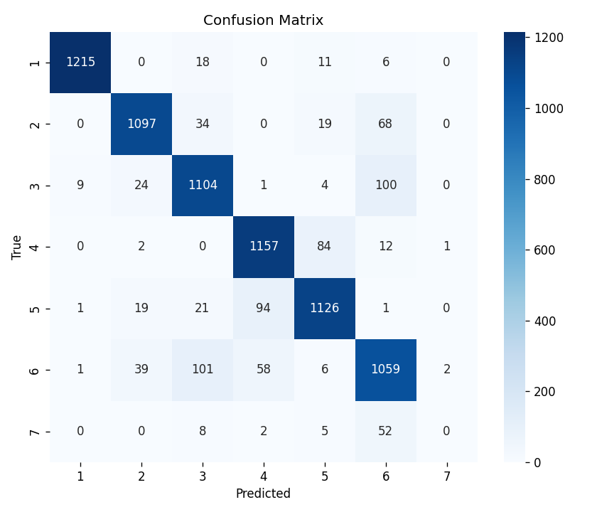

# Validation Report: UCI_Gesture
*Generated 2026-04-26 11:49*

## Dataset Overview
- **Subjects**: 1
- **Channels**: 8
- **Sampling Rate**: 1000 Hz
- **Movements**: 6

## Processing Parameters
- **sampling_rate**: None
- **bandpass**: [20, 450]
- **notch**: 50
- **window_size_ms**: 400
- **overlap**: 0.5
- **normalize_signal**: False
- **compute_ar**: False
- **ar_order**: 6
- **compute_hjorth**: True
- **compute_inter_channel_corr**: True
- **compute_wavelet**: False
- **wavelet_name**: db4
- **wavelet_level**: 4
- **compute_freq_features**: True
- **fft_pad_to_power_of_two**: True
- **use_sliding_window**: True
- **ssc_threshold**: 0.05
- **subsample_every_n**: 1
- **windowing_chunk_size**: 2048
- **downsample_large**: False
- **downsample_threshold**: 2000000
- **active_signal_detection**: False
- **active_signal_threshold**: 0.02
- **corr_channels**: 0

## Feature Statistics (first 20 features, Mean +/- Std)
| Movement | ch0_IEMG | ch0_MAV | ch0_logMAV | ch0_MAVS | ch0_SSI | ch0_RMS | ch0_logRMS | ch0_VO3 | ch0_LogDet | ch0_WL | ch0_ZCR | ch0_SSC | ch0_logVAR | ch0_Skew | ch0_Kurt | ch0_TKEO | ch0_HjAct | ch0_HjMob | ch0_HjCmp | ch0_MNF |
|---|---|---|---|---|---|---|---|---|---|---|---|---|---|---|---|---|---|---|---|---|
| 1 | 0.0026 +/- 0.0006 | 0.0000 +/- 0.0000 | -11.9835 +/- 0.3432 | -0.0000 +/- 0.0000 | 0.0000 +/- 0.0000 | 0.0000 +/- 0.0000 | -11.6790 +/- 0.2727 | 0.0000 +/- 0.0000 | 0.0000 +/- 0.0000 | 0.0010 +/- 0.0002 | 0.0982 +/- 0.0207 | 0.0000 +/- 0.0000 | -23.3388 +/- 0.5275 | 0.0555 +/- 0.8716 | 3.2922 +/- 11.7678 | 0.0000 +/- 0.0000 | 0.0000 +/- 0.0000 | 0.6624 +/- 0.0955 | 2.1619 +/- 0.1943 | 82.9736 +/- 16.8276 |
| 2 | 0.0351 +/- 0.0112 | 0.0001 +/- 0.0000 | -9.4071 +/- 0.3893 | -0.0000 +/- 0.0000 | 0.0000 +/- 0.0000 | 0.0001 +/- 0.0000 | -9.0877 +/- 0.3518 | 0.0002 +/- 0.0000 | 0.0001 +/- 0.0000 | 0.0160 +/- 0.0048 | 0.1056 +/- 0.0268 | 0.0000 +/- 0.0000 | -18.1729 +/- 0.7035 | 0.0444 +/- 0.6416 | 3.2866 +/- 2.9443 | 0.0000 +/- 0.0000 | 0.0000 +/- 0.0000 | 0.7489 +/- 0.1039 | 2.0043 +/- 0.2225 | 96.5649 +/- 17.8477 |
| 3 | 0.0324 +/- 0.0116 | 0.0001 +/- 0.0000 | -9.4854 +/- 0.3672 | -0.0000 +/- 0.0000 | 0.0000 +/- 0.0000 | 0.0001 +/- 0.0000 | -9.1850 +/- 0.3503 | 0.0001 +/- 0.0000 | 0.0001 +/- 0.0000 | 0.0134 +/- 0.0044 | 0.1025 +/- 0.0224 | 0.0000 +/- 0.0000 | -18.3676 +/- 0.7004 | -0.1514 +/- 0.4272 | 2.0134 +/- 1.7269 | 0.0000 +/- 0.0000 | 0.0000 +/- 0.0000 | 0.6902 +/- 0.0836 | 2.1180 +/- 0.1828 | 87.0360 +/- 13.1663 |
| 4 | 0.0081 +/- 0.0028 | 0.0000 +/- 0.0000 | -10.8576 +/- 0.3279 | -0.0000 +/- 0.0000 | 0.0000 +/- 0.0000 | 0.0000 +/- 0.0000 | -10.5265 +/- 0.2920 | 0.0000 +/- 0.0000 | 0.0000 +/- 0.0000 | 0.0035 +/- 0.0009 | 0.1123 +/- 0.0247 | 0.0000 +/- 0.0000 | -21.0492 +/- 0.5833 | 0.0696 +/- 0.7599 | 3.7227 +/- 7.5648 | 0.0000 +/- 0.0000 | 0.0000 +/- 0.0000 | 0.7233 +/- 0.1105 | 2.0415 +/- 0.2151 | 93.3355 +/- 18.6100 |
| 5 | 0.0105 +/- 0.0047 | 0.0000 +/- 0.0000 | -10.6346 +/- 0.3924 | -0.0000 +/- 0.0000 | 0.0000 +/- 0.0000 | 0.0000 +/- 0.0000 | -10.3054 +/- 0.4108 | 0.0000 +/- 0.0000 | 0.0000 +/- 0.0000 | 0.0047 +/- 0.0019 | 0.1099 +/- 0.0267 | 0.0000 +/- 0.0000 | -20.6077 +/- 0.8207 | 0.1534 +/- 0.7396 | 3.6598 +/- 3.8244 | 0.0000 +/- 0.0000 | 0.0000 +/- 0.0000 | 0.7213 +/- 0.0811 | 2.0626 +/- 0.1758 | 91.7062 +/- 13.0953 |
| 6 | 0.0357 +/- 0.0135 | 0.0001 +/- 0.0000 | -9.3966 +/- 0.3792 | -0.0000 +/- 0.0000 | 0.0000 +/- 0.0000 | 0.0001 +/- 0.0000 | -9.0710 +/- 0.3720 | 0.0002 +/- 0.0001 | 0.0001 +/- 0.0000 | 0.0153 +/- 0.0060 | 0.1064 +/- 0.0294 | 0.0000 +/- 0.0000 | -18.1398 +/- 0.7439 | -0.0770 +/- 0.8623 | 3.0500 +/- 3.6325 | 0.0000 +/- 0.0000 | 0.0000 +/- 0.0000 | 0.6887 +/- 0.0895 | 2.1207 +/- 0.2066 | 87.2272 +/- 14.8879 |

## Classification Results
- **Strategy**: Leave-One-Subject-Out (LOSO)
- **Accuracy**: 86.15% +/- 0.00%

### Per-Subject Accuracy
| Subject | Accuracy |
|---|---|
| Subject ? | 86.15% |

### Confusion Matrix

## Issues
None.